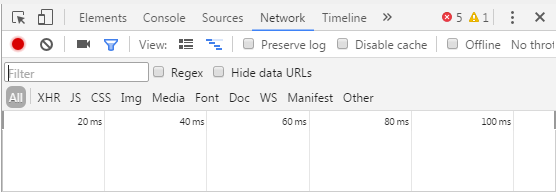
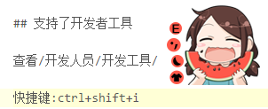
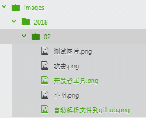

## Atom常用命令:
```
项目内查找文件:ctrl+p
清除一行:ctrl+u
选中一行:ctrl+l
输入命令行:ctrl+shift+p
```
## git 的使用
```
1.添加到暂存区
2.添加提交信息
3. push到远程库

最重要的是你要保存文件(ctrl+s),在右侧的Git窗口下,将待提交的文件移到暂存区中,然后commit,最终push.

需要输入账户和密码.
```
图文展示:


查看日志:


## 支持了开发者工具

查看/开发人员/开发工具/

展示:



类似于Google的F12.

## 支持图片解析

这真是一个最NB的技术,以前还需要图床解析到简书.

确实人家牛B,你截图完了以后,按快捷键,ctrl+shift+i.,输入以后,Atom会把图片自动给你解析到github.至于侵犯隐私什么的,我只是一个无名小卒,恐怕人家没工夫瞅咱把.

展示



这个图片其实是保存在本地,Atom给你解析准成链接到GitHub了.

我们可以可以随便拿出一张链接看看:
``
https://github.com/lovemoganna/Atom/blob/master/images/2018/02/%E6%B5%8B%E8%AF%95%E5%9B%BE%E7%89%87.png
```




这个用的最爽!!!
